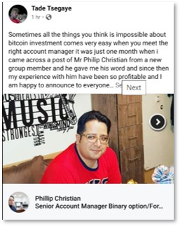

# Moderator Guidelines

## Adding Members 

**There are a lot fake accounts on Facebook; particularly in the crypto space.**  

Thus, it can be **very frustrating & tiring** to figure out who is real or fake **in the** **shortest amount of time** as sometimes this group might receive as many as 500+ membership requests a day.

The good news is **there is a pattern** to identifying fake accounts.

Hence, please adhere to the following guideline to save you time and effort moderating this group.

### **1\) Don't Block. Just Decline.**

Blocking requires an extra click. So don't bother with it. 

There is no stopping the flood of requests coming from fake accounts. So blocking one doesn't prevent the bad actor from requesting access using another fake account. Because of the huge number of requests we can get in single day, **it is very tiring for the moderator to block all of them.**

So, just decline.

Plus, sometimes we might accidentally decline a legit request. That's okay.  
At least, the user isn't blocked and if the user is real, they can request again because they are not blocked.

### 2\) Decline requests from Nigeria. 

As a general rule, the probability of a real user from Nigeria is very slim. This policy is not intended to discriminate against their countrymen. We discriminate fake accounts and scammers. If you verify a user to be a real person from Nigeria, please invite them in.

### 3\) Decline requests from newer FB accounts e.g. 2020, 2019, 2018

The newer the account is made, the higher probability it is fake. 

### 4\) Decline requests from users with no profile picture.

 Users who do not have a photo profile have high probability to be fake accounts. 

### 5\) Decline users who are linked to dodgy ambiguous groups.

Red flag keywords include binary options, cloud mining, HYIP, MLM, sugar mommies, sugar daddies... it's a non-exhaustive list. 😓

### 6\) Decline users who have ambiguous names & descriptions

### 7\) Decline users when something just feels off

### 8\) Decline users whose account somehow doesn't exist.

## Summary  

Essentially, we don't need fake accounts to bump up our group numbers. It adds no value, annoys our members and **it gives us extra work we don't need**.

So, the general rule is **be very strict**.   
  
If a user request looks suspicious in **any way**, just decline.

After all, it is **not** a block. A real user would write back and that is a good thing.

We only want real, good quality members and contributors in our group. We hope with these clear moderator guidelines, we will see significant decrease in fake accounts and we can focus on attracting real high quality members into our group.

